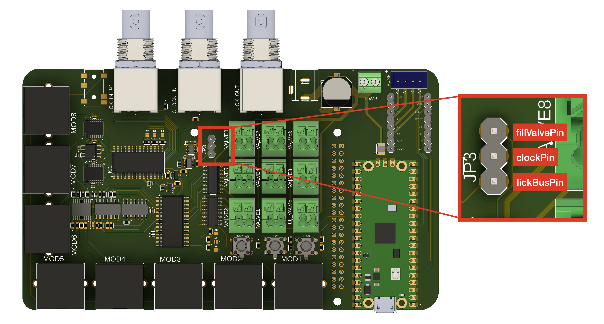
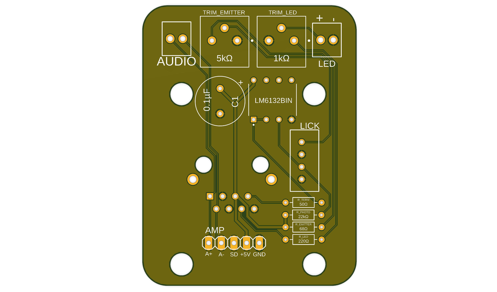

## Interface PCB
### Required Components
* Assembeld Interface PCB + additional components that could not be assembled by the PCB manufacturer
* DRV8825 stepper motor driver (x1)
* Raspberry Pi (≥4)
* Male to Male Audio Cable (optional)
* [Innomaker HIFI DAC Pro Hat](https://www.amazon.com/Raspberry-DAC-Pro-ES9038Q2M-Resolution/dp/B0B2DJZTSF) (optional)
* Female to Female jumper
* USB cable

### Assembly Steps
*Flashing Pump Code to the Pico*

In order to test out the electronics at the end we will need to have the pico firmware loaded. This is best done on a device other than the pi. We'll follow the steps detailed [here](https://randomnerdtutorials.com/programming-raspberry-pi-pico-w-arduino-ide/) to flash [pump control code](../pico/pump_control/pump_control.ino) to flash the code to the pi using the Arduino IDE.

1. Install the Arduino IDE on the device you will use to flash the code. 
2. Navigate to either Settings or Preferences depending on your OS.

3. Enter the following URL in the "Additional Board Managers" field:
```
https://github.com/earlephilhower/arduino-pico/releases/download/global/package_rp2040_index.json
```
4. Go to **Tools > Board > Boards Manager**
5. Search for “pico” and install the Raspberry Pi Pico/RP2040 boards
6. Open the [pump control code](../pico/pump_control/pump_control.ino) in the IDE.
7. While the Raspberry Pi is unplugged, go to **Tools>Boards** and select Raspberry Pi Pico.
8. Hold the BOOTSEL button on the Pico while plugging it into your device.
9. Open the drop-down menu at the top and select "Select other board and port...". From here select the Rasperry Pi Pico as your board and "UF2 Board UF2 Devices" as the port. You may need to check the box that says "Show all ports"

10. Finally click the arrow at the top to flash the code to the Pico.


*Seting up the PCB*

1. Solder any components not soldered by the PCB manufacturer. The v1 PCB unfortunately does not have labels for all components on the board so we show the labels below. You can match component names to the part itself using the BOM for the PCB assembly job. Importantly, resistors are not labeled in this image as we generally recommend at least having these mounted by your manufacturer. (*NOTE: For all ICs the dot indicates the top left corner*)

2. Plug the stepper motor driver in the appropriate slot on the interface PCB being careful to match the pins correctly.
3. Now we will attach the components to the pi. The pi should be turned off at this stage. If Audio is needed plug in the audio hat first followed by the assembled interface PCB. Connect the audio hat to the interface PCB additionally by an audio cable (use the headphone jack of the audio hat). Use standoffs as needed.
4. Power on the Pi first by plugging in the Pi power supply, then power on the Interface by plugging in the 12V supply.
5. Use a multimeter to set VREF of the stepper motor driver to 1V such that the max current output will be limited to 2A. The steps to do this are outlined [here](https://www.pololu.com/product/2133) but we will briefly note them below.

    a. Measure VREF by first placing the negative probe of the multimeter on ground (this can be accessed from the negative screw of the PWR screw terminal; you will need to screw in place a loose wire first for this to work). Place the positive terminal on the trimpot itself.
    
    b. Turn the trimpot until VREF is 1V

6. Plug any valves in to their appropriate slots on the interface. Plug in the pump as well.
7. Use a jumper to connect the male header pins to the appropriate GPIO pins given your config.yaml and presets.yaml file. These pins are unfortunately not labeled on the board in v1 but we show the names below:

8. Plug the Pico into the Raspberry Pi using a USB cable. Use the flush and reverse buttons to ensure the pump is functional. Press the fill valve button to ensure this valve can be toggled by the button.


## Module PCB
### Required Components
* Module PCB
* 0.1µF electrolytic capacitor - [C1]
* 2-pin screw terminal (x2) - [AUDIO, LED]
* [1kΩ Trim Potentiometer](https://www.digikey.com/en/products/detail/bourns-inc/PV36P102C01B00/666482) (x1) - [TRIM_LED]
* [5kΩ Trim Potentiometer](https://www.digikey.com/en/products/detail/bourns-inc/PV36P502C01B00/666496) (x1) - [TRIM_EMITTER]
* JST female connector (x1)
* Ethernet Conector (x1)
* LM6132BIN (x1) 
* 50Ω resistor (x1) - [R_TERM]
* 22kΩ resistor (x1) - [R_PHOTO]
* 68Ω resistor (x1) - [R_EMITTER]
* 220Ω resistor (x1) - [R_LED]


### Assembly Steps

*Setting up the PCB*
1. Solder all components to the PCB. The v1 module PCB is missing labels for the values of vertain components so we show them below. (*NOTE: The ethernet connector is meant to be soldered on the back of the PCB. Also, For the LM6132, the square solder pad indicates where the top left corner of the component should go*)


*Setting the Lickometer Trimpot*
1. Once all other electronics have been assembled and all software has been installed, plug the assembled lickometer into the module PCB and plug the module PCB into the interface. 
2. Start the ratBerryPi server and trigger licks with an object of comparable size to a mouse or rat tongue. We usually use a small flathead screwdriver. 
3. Start with the trim_emitter potentiometer set to a fairly high resistance and lower the resistance to a point beyond which you no longer register licks.