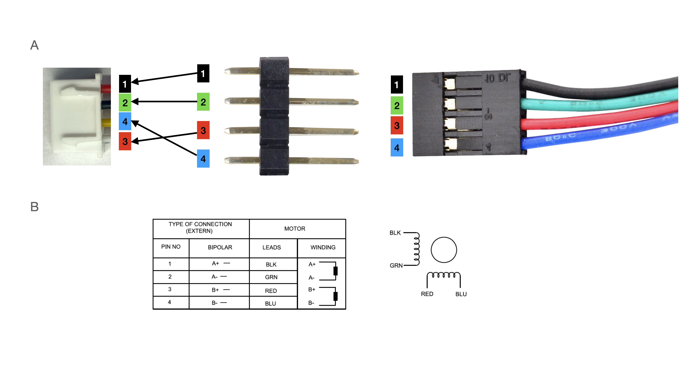
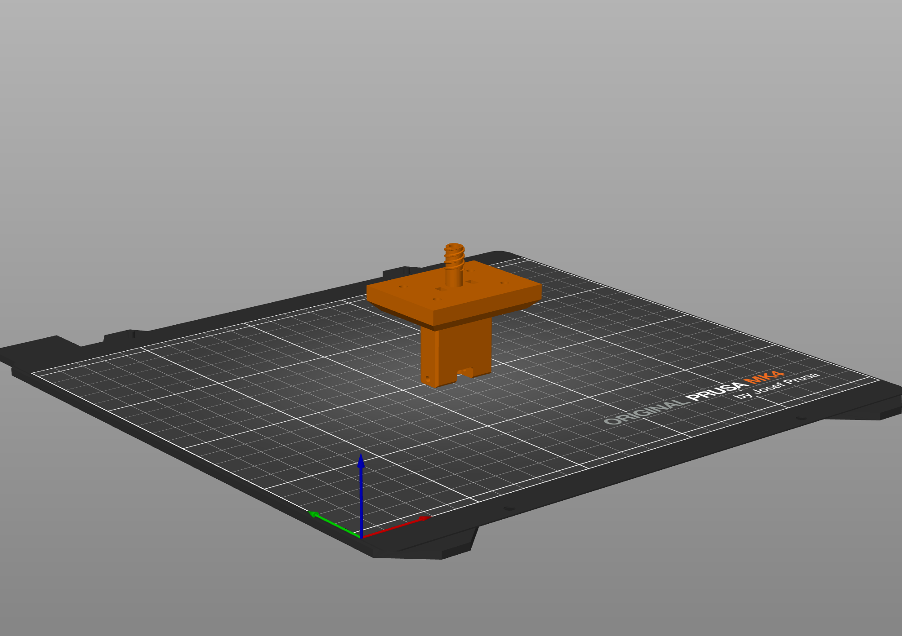

## Pump Assembly
### Required Components

*Printed Parts*
* [Pump Carriage Sled](../hardware/3Ddesigns/stl/pump_carriage_sled.stl)
* [Pump Base](../hardware/3Ddesigns/stl/pump_base.stl)
* [Syringe Clamp](../hardware/3Ddesigns/stl/pump_syringe_clamp.stl)
* [Syringe Brace](../hardware/3Ddesigns/stl/pump_syringe_brace.stl)

*Additional Pieces*
* M3 Hex Nuts (x8)
* 10 mm long M3 socket head screws (x4)
* 20 mm long M3 socket head screws (x4)
* 25 mm long M3 socket head screws (x4)
* 12 mm long M4 thumb screw (x2)
* [M4x6 threaded inserts](https://www.amazon.com/100pcs-M4-Threaded-Inserts-Components/dp/B0CZXMXZG2/ref=asc_df_B0CZXMXZG2/?tag=hyprod-20&linkCode=df0&hvadid=693637112524&hvpos=&hvnetw=g&hvrand=18070985569350448006&hvpone=&hvptwo=&hvqmt=&hvdev=c&hvdvcmdl=&hvlocint=&hvlocphy=9031119&hvtargid=pla-2355037181884&mcid=de6cd1ac120c37788256b2d3de154efd&th=1) (x2)
* M5 Hex Nut (x1)
* [50 mm long M5 Knob](https://www.amazon.com/Kipp-06220-405X50-Thermoplastic-External-Diameter/dp/B013I72QTY/ref=sr_1_6?s=industrial&ie=UTF8&qid=1513737752&sr=1-6&keywords=M5+knob) (x1)
* [150 mm long T8 Lead Screw + Nut](https://www.amazon.com/150mm（5-9-Inches）Tr8x2-Thread-Printer-Machine/dp/B0B8RGRYNW/ref=sr_1_2?crid=2PI5409AN7P8M&dib=eyJ2IjoiMSJ9.NOXkkOYI_8yEDDdQ4KmFjBWnvBEwRLslsTZclAvBnbL_KOv4d9s6TYV7Yn544udbtQOYQXvm2dr9G_Ep9ubmZK9Rg4Xr69crSYm5hNxOl-wg4prLb-qqFuYFbljIq9QVpmSEQVmfwoT48KGZFxoAb-WrPK3JdLU6P3ORKLwpgLvZrBFGSQqaKDwgmBYALRPol7djfDgh1sJT8BxapY-XdOXylolAWgHEqzAiywRl2d1UcMa3TGKzSWVdgSiVDuHt1jn8gQtWl0cUQW8XgRdSmPLsAtrViMXtH6d-Jm2j6IM.4UlREFWkPLfs1N6UiTGZtPtQ8Gy_k3MyA0ZD5ybcKd8&dib_tag=se&keywords=150mm%2Btr8x2%2Bacme%2Blead%2Bscrew%2Band%2Bbrass%2Bnut&qid=1728682639&s=industrial&sprefix=150mm%2Btr8x2%2Bacme%2Blead%2Bscrew%2Band%2Bbrass%2Bnut%2Cindustrial%2C183&sr=1-2&th=1) (x1)
* [Flexible Motor Lead Screw Coupling](https://www.amazon.com/AFUNTA-Flexible-Couplings-Compatible-Machines/dp/B07JL1QYLS/ref=pd_bxgy_thbs_d_sccl_1/141-5956694-6505548?pd_rd_w=qr3Ns&content-id=amzn1.sym.4e8180d8-1c12-4df8-af99-b6dc78fc0026&pf_rd_p=4e8180d8-1c12-4df8-af99-b6dc78fc0026&pf_rd_r=4T94AV7PVW2MM7R65NRM&pd_rd_wg=a20A0&pd_rd_r=dc5a870c-a3d4-4b0e-ba6b-15bc7fdf8f1d&pd_rd_i=B07JL1QYLS&psc=1) (x1)
* [Nema 17 Bipolar Stepper Motor](https://www.amazon.com/STEPPERONLINE-Stepper-Bipolar-Connector-compatible/dp/B00PNEQKC0) (x1)
* [Steel Rods](https://www.amazon.com/Steel-Round-Turning-Lathe-200mm/dp/B00LUSVKVY/ref=pd_sim_469_2?_encoding=UTF8&pd_rd_i=B00LUSVKVY&pd_rd_r=G7BG21YGXPVGEYXQ3GW3&pd_rd_w=WYFjR&pd_rd_wg=t8WZj&refRID=G7BG21YGXPVGEYXQ3GW3&th=1) (x2)
* [Linear Motion Ball Bearings](https://www.amazon.com/Linear-Motion-Bearing-Bushing-Printer/dp/B07K71FWMG/ref=pd_bxgy_thbs_d_sccl_2/138-0211087-8320359?pd_rd_w=7Q4QU&content-id=amzn1.sym.3858a394-39a9-4946-90e6-86a3153d2546&pf_rd_p=3858a394-39a9-4946-90e6-86a3153d2546&pf_rd_r=6N2RDYHQYJK3EC33EJZV&pd_rd_wg=J7q7j&pd_rd_r=3c87071d-28a5-4f1b-80da-199966422f73&pd_rd_i=B07K71FWMG&psc=1) (x2)
* [JST Xh 4 Pin Male Connector Pre-Assembled](https://www.amazon.com/Sets-2-5-4-Connector-200mm-Female/dp/B01DUC1S14) (x1)
* White Lithium Grease (or lubricant of your choice)

### Assembly Steps
*Assemble the carriage sled*
1. Secure the lead screw nut to the carriage sled using the 25 mm long M3 screws and hex nuts. Start by positioning the lead screw nut in its designated hole on the back of the carriage sled as shown below, then align the holes in the nut with the holes in the sled.
2. Secure the threaded M4 inserts inside the holes of the syringe clamp. Start by positioning the inserts by hand on the flat surface of the clamp, then use a soldering iron to heat up the insert and push it into the material until the front face of the insert is flush with the flat face of the clamp.
3. Attach the clamp to the carriage sled using the thumb screws.
4. Pop the linear motion ball bearings into the sides of the carriage sled.

*Secure the Motor*
1. First couple the lead screw to the motor using the flexible coupler.
2. Feed the attached lead screw through the hole on the back side of the pump base and manually rotate the lead screw to mate it with the nut in the carriage sled. Position the carriage sled approximately halfway down the length of the lead screw.
3. Use the 20mm long M3 screws to secure the motor to the base of the pump.
4. Feed the rods through the appropriate holes in the pump base.
5. Place the remaining hex nuts in the square holes shown in the image below. Slide the nuts in until you can see the hole in the middle from the screw hole.
6. Secure the rods in place with the 10mm long M3 screws through the hex nuts placed in step 5.

*Attach the Syringe Brace*
1. Drop the M5 nut in the hole shown below and thread the M5 knob through it.
2. Place the syringe brace on the end of the knob.

*Making the Connector*

We use a different connector from the one that comes with the motor to interface the motor to the pcb. This is in part to correct for a difference in the pin ordering on the connector that comes with the motor. The main reason, however, is that the connector we use instead is polarized which allows us to enforce that the pins are plugged in the correct order. The reverse order would cause the pump to move in the opposite direction of what the software expects. Below we'll describe the steps to assemble an adapter.

1. Solder the wires of the JST connector to the 4-pin male header following the arrows in the image below. Note the mapping shown in A is based on the pin map in the documentation for this motor copied in B. If in the future the mapping of pin to wire color on the motor changesm these mappings should be updated accordingly.

2. Plug the adapter into the motor connector in the orientation shown in the image above.

Once the pump is fully assembled, apply white lithium grease to the threads of the lead screw and both rods. Once the electronics for the interface have been assembled, plug the pump into the interface, power on the pump (i.e. plug in the 12V power supply) and use the flush and reverse buttons to spread the grease along the length of the rods. Clear away any excess when finished.

## Manifold Assembly
### Required Components
*Printed Parts*
* Manifold Mount

*Additional Pieces*
* [Solenoid Media Isolation Valves [Clippard NR1-2-12]](https://www.clippard.com/part/NR1-2-12) (x9 or $n_{modules}$ + 1)
* Luer Manifold (several 3-way luer stopcocks might work instead)
* 1/16" ID PVC tubing
* O-Rings
* Barb Fittings
* Male Luer to Barb adapter (x20 or $(n_{valves} + 1)*2$)

### Assembly Steps
...

## Lickometer Assembly
### Required Components
*Printed Parts*
* [Mouse Lickometer](../hardware/3Ddesigns/stl/lickometer_mouse.stl) or [Rat Lickometer](../hardware/3Ddesigns/stl/lickometer_rat.stl) 

***Note about printing:*** *we recommend printing with the front of the lickometer on the print bed for these files like shown below. Furthermore if your slicer supports it, only use supports on the bed of the printer. These settings ensure there will be no supports in the channels where the sensors need to go*

*Additional Pieces*
* IR Emitter (x1)
* IR Phototransistor (x1)
* [JST Xh 4 Pin Male Connector Pre-Assembled](https://www.amazon.com/Sets-2-5-4-Connector-200mm-Female/dp/B01DUC1S14) (x1)
* x mm long M3 set screws

### Assembly Steps
1. Solder the wires of the JST connector to the IR Emitter and Phototransistor following the below diagram

2. Tap M3 or M4 threads in the holes indicated below.

3. Insert either the emitter or phototransistor into one of the slots in the lickometer with the bulb facing towards the inside of the lickometer. Be careful to go only far enough such that the entire bulb is visible from the hole looking into the lickometer well. 

4. Secure the emitter or phototransistor in place using an M3 set screw.
5. Repeat steps 3 and 4 for the other component using the other slot.