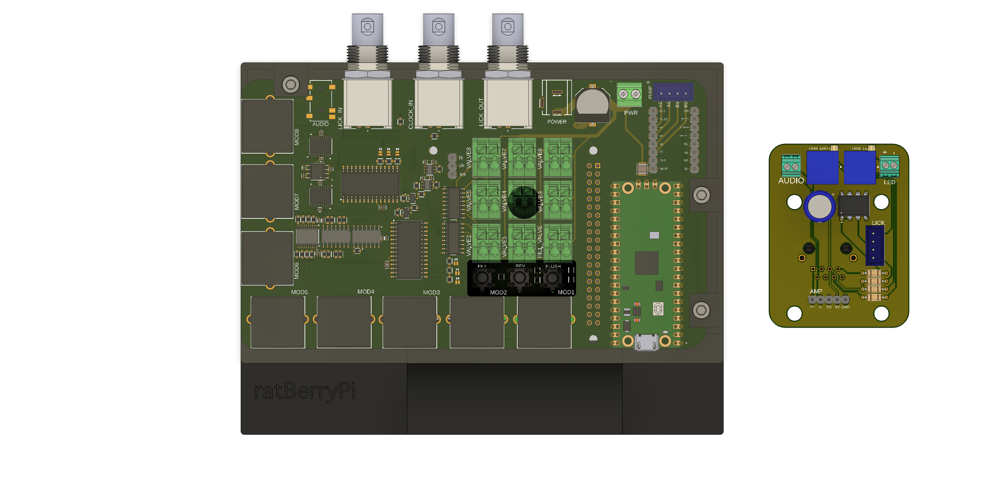

## Electronics Overview
The 2 main hardware components of the system are the interface and the modules. The interface is a HAT that sits on a raspberry pi, but often we may refer to the entire unit as the interface. Similarly when we refer to modules we are usually referring to the entire reward module unit consisting of all attached devices (lickometer, speaker, and LED). At it's core, however, the reward module is controlled by a PCB that usually is packaged with the module. This PCB has the main electronics needed to operate all devices. The interface functions as a hub for all modules to plug into and offers some additional features which we will describe below.

### User Selectable I/O
Most digital I/O in the ratBerryPi system is handled through extended GPIOs provided by 2 I2C interfaces on each interface HAT. The effect is that most GPIOs on the Pi itself remain available for users program as they wish. The caveat is that there are 2 signals that could not be allocated to a slot on the I2C interfaces due to space constraints and another that needs to be read by a GPIO on the pi itself for performance reasons. Instead of hardwiring these signals to any GPIOs on the Pi we allow the user to configure them as needed. The benefit of this setup is that in the event you need to stack interface HATs, you can select different pins for each HAT as needed. The that need to be assigned to GPIOs are as follows:

* **Fill Valve Software Control** - This allows the user to set the state of the valve leading up to the reservoir in software (see [Fluid Delivery System](#fluid-delivery-system))
* **Clock Input** - see [Clock Signal](#clock-signal)
* **Lick Bus Interrupt** - all lick signals on a given interface HAT are read on the same bus of one of the I2C interfaces. There is an interrupt pin on this bus that we've configured to be LOW normally but write HIGH when when a rising edge is detected on any pins on the bus. This interrupt signal needs to be read by a designated GPIO pin on the pi itself for any licks to be registered. The idea is when this GPIO pin on the pi reads a HIGH value ratBerryPi polls the I2C interface to see which GPIO on the bus caused it. For those curious, the reason for this configuration is that the gpiozero, the library we use in python to control the GPIOs, provides an interface to configure callback functions to run very quickly on the rising or falling edge of a digital signal. We use a separate library to program the I2C interface and this library does not offer this functionality. As such the best you would be able to do otherwise is to spawn a python thread that continuously polls the state of the GPIOs on the I2C interface.

### OR'd Licks
In many setups there may be a central unit that you want to use to timestamp all events that occur during experiments. In such scenarios we offer 2 ways of getting timestamps of lick events on the clock of your timestamping unit. One is through the **CLOCK IN** port that we will discuss later. The other is through the **LICK OUT** port. This port broadcasts a 5V TTL signal which represents the result of a hardware "OR" operation over all modules on the interface. This is implemented in hardware by a cascade of pairwise logical OR gates where the inputs are the digitized lick signals. Importantly, at the last step, the OR's lick signal from the modules on a given interface is OR's with any licks provided through the **LICK IN** port. This port takes 5V logic. The result is that if you stack interface HATs or use multiple interfaces in a given setup, you can chain together multiple interfaces and the OR'd lick output of the last interface will be the OR'd licks over all modules. 

### Clock signal
One can use the software interface provided through this repo to log relevant events that occur. One method of synchronizing this datastream with datastreams on other systems is a method detailed in the OpenEphys documentation. Briefly, the idea is to timestamp a common clock signal on all devices. This signal is some digital signal with known temporal structure that can be used to map timestamps on all devices to a common clock. We support use of such a system with the **CLOCK IN** port. Users may plug such a clock signal (5V logic) into this connector and an event called clock will be logged with respect to the pi's system clock on the rising edge of all pulses detected on this port. Considering all other events logged through ratBerryPi are also logged against system clock, you can use the timestamps of these clock events to remap system clock of the pi against a common clock for all relevant devices.

### Stackable HATs
This feature has not been tested as yet, but in principle the interface HATs are designed to be stackable. When stacking HATs, the following should be taken into consideration:
* Be sure to daisy chain 12V power to all stacked HATs. The PWR screw terminal is there for this purpose
* Update the I2C address on all stacked HATs to be unique. This can be done using the address select jumpers (A0-A2 and B0-B2) on the interface HAT. Jumping any pads together sets that bit in the I2C address to 1. By default, (A0=0, A1=0, A2=0) and (B0=1, B1=0, B2=0).

### Audio
All modules have a screw terminal to plug in a speaker. Audio is provided to the modules from a single audio source which can be plugged in through the headphone jack on the HAT. This audio source can either be an audio HAT (specifically the [Innomaker HIFI DAC Pro HAT](https://www.amazon.com/Raspberry-DAC-Pro-ES9038Q2M-Resolution/dp/B0B2DJZTSF)) or the pi itself if using a Raspberry Pi 4. Importantly if using the Pi audio, you will need to amplify this audio on the level of the module. For this you can use the PAM8302 Class D Amplifier. There is a designated spot on the module PCB for it. Instead of plugging the speaker into the AUDIO screw terminal, you can use the output of the PAM8302. 

It's worth noting that because audio in this system is provided by a single source, it would not be possible to play different audio on different speakers. You may however, play the same audio on a subset or one of many speakers. This is handled by an onboard analog switch which directs the audio input to the desired end point.

## Fluid Delivery System
They main components of the fluid delivery system are the syringe pump, the valves that lead up to each reward module, the valve that leads up to the reservoir (the fill valve), the reservoir and the manifold of 3-way stopcocks that all valves are mounted to. 

Many of these components are there to enable automatic refilling of a syringe without the need for unloading, However, the fundamental function of the system, namely delivering reward to a specified module, is supported primarily by the valves for each module and the pump. In practice, this is what a reward delivery looks like in this system:

1. A GPIO pin is set to a HIGH state in order to open the valve for a specified module
2. We wait a set period of time for the valve to actually open.
3. The pump advances to perfuse the requested reward amount.
4. We wait for a set period of time to ensure the entire reward amount has made it to the module (this is necessary because any compliance in the lines means that reward delivery is not instantaneous)
5. The GPIO pin associated to the valve is set to LOW to close the valve.
6. We wait to make sure the valve is closed.

Whenever we need to refill the syringe this is accomplished by closing all valves except the fill valve, opening the fill valve, and running the pump in reverse to draw fluid from the reservoir into the syringe. We added a clamp to the pump to allow the syringe to be secured in place to avoid significant slack when switching between reversing and advancing the pump. However, to be safe, a small volume is pumped to the reservoir before any reward delivery after the pump was in reverse.
